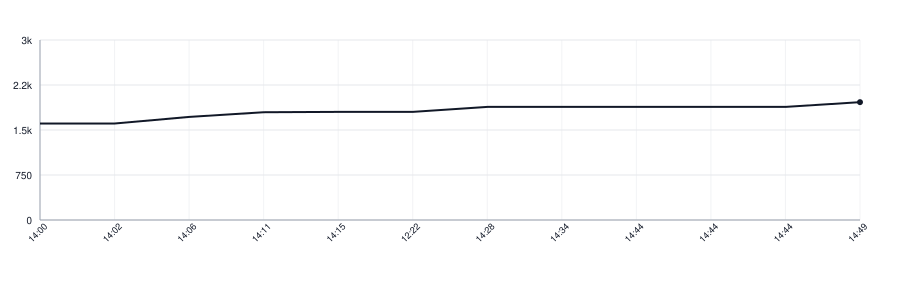

[](https://github.com/wikilayer/wikilayer-client-swift/actions/workflows/tests.yml)
[](https://wikilayer.github.io/wikilayer-client-swift/documentation/wikilayerclient/)

# Wikilayer Client for Swift

The Swift client for the Wikilayer API. It owns the requests and responses that
cross the network: authentication, the public directory, address resolution,
wiki synchronisation and the live change channel.

It does not own a local database, screen state or background scheduling. An app
decides how a received `SyncNode` is stored and when another pass starts.

Add the package dependency and the `WikilayerClient` product:

```swift
.package(url: "https://github.com/wikilayer/wikilayer-client-swift.git", from: "0.2.0")
```

```swift
let hosts = WikiHostConfiguration.bundled.pool()
let api = WikiAPI(hosts: hosts)

let directory = try await api.wikis(matching: "markdown")
let batch = try await api.sync(wikiID: 2982, after: nil)
```

## Host configuration

The library ships the primary server and any mirrors in `hosts.yaml`; applications
use `WikiHostConfiguration.bundled` instead of copying those addresses. Safe reads
can move to another host after a retryable failure, while one-use authentication
credentials remain bound to one selected host. See the generated guides to
[hosts and mirrors](https://wikilayer.github.io/wikilayer-client-swift/documentation/wikilayerclient/hostsandmirrors/)
and [authentication flows](https://wikilayer.github.io/wikilayer-client-swift/documentation/wikilayerclient/authentication-flows/).

## Running it

```sh
make test
make lint
make docs
```

## Lines of Code

<picture>
  <source media="(prefers-color-scheme: dark)" srcset=".github/loc-history-dark.svg">
  <source media="(prefers-color-scheme: light)" srcset=".github/loc-history-light.svg">
  
</picture>
